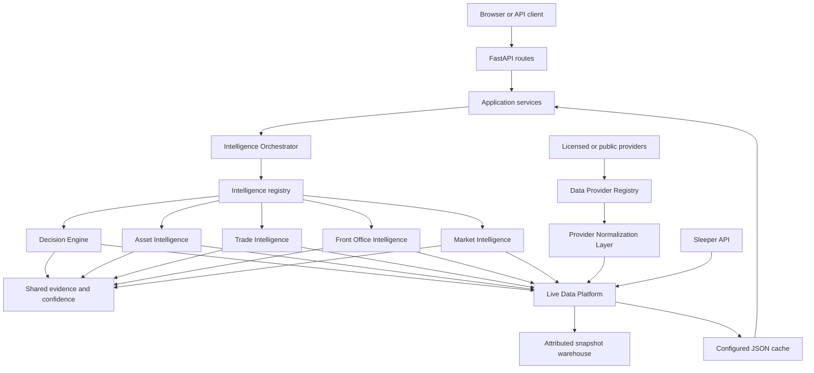

# Architecture Guide

## Boundaries

- `dtos_app.py` owns setup, lifecycle, shared page chrome, and router registration.
- `routes/` owns HTTP translation only.
- `services/` assembles application view models and calls public platform contracts.
- `src/core/intelligence/` owns context, provider registration, orchestration, caching, evidence, confidence, conflict resolution, and unified outputs.
- `src/core/data_platform/` is the only external-provider boundary and owns provider contracts, licensing, refresh planning, provenance, storage, aggregation, quality, health, and fallback disclosure.
- `src/core/data_platform/normalization/` owns canonical player identity and mandatory provider-format reconciliation before values enter storage, consensus, APIs, or intelligence.
- Domain engines own evaluation implementations but do not call application services.
- `src/platform/` owns cross-cutting observability and validation.

The call dependency is Application → Orchestrator → Intelligence Engines → Data Platform → registered adapters. Inbound data flows External Providers → Provider Registry → Normalizer → Data Platform → Intelligence Orchestrator. Services and routes may not import intelligence implementation packages directly, and intelligence engines may not consume provider-specific objects.

## Data lifecycle

Sleeper synchronization normalizes data into one cache snapshot. A request selects a Front Office, builds an immutable intelligence context, executes or reuses provider results, aggregates evidence, resolves conflicts conservatively, and renders HTML or JSON. Refresh invalidates the affected orchestration namespace.
