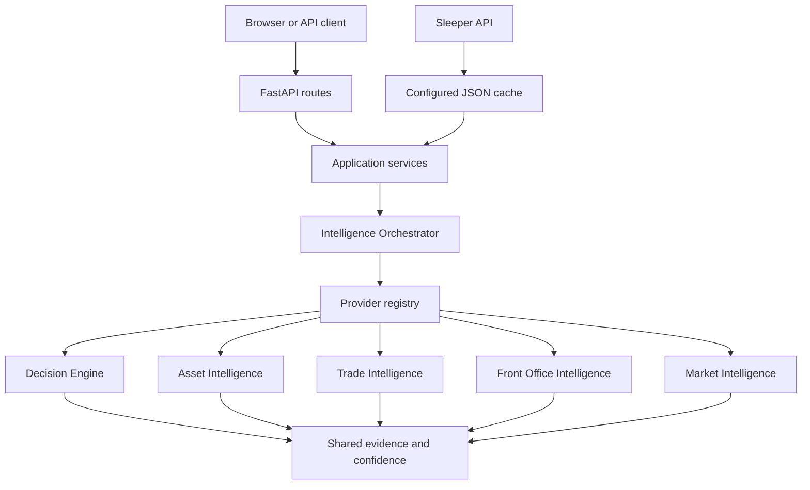

# Architecture Guide

## Boundaries

- `dtos_app.py` owns setup, lifecycle, shared page chrome, and router registration.
- `routes/` owns HTTP translation only.
- `services/` assembles application view models and calls public platform contracts.
- `src/core/intelligence/` owns context, provider registration, orchestration, caching, evidence, confidence, conflict resolution, and unified outputs.
- Domain engines own evaluation implementations but do not call application services.
- `src/platform/` owns cross-cutting observability and validation.

The enforced dependency direction is Application → Orchestrator → Providers → external/cached data. Services and routes may not import intelligence implementation packages directly. Domain output contracts remain independently usable behind orchestrator adapters.

## Data lifecycle

Sleeper synchronization normalizes data into one cache snapshot. A request selects a Front Office, builds an immutable intelligence context, executes or reuses provider results, aggregates evidence, resolves conflicts conservatively, and renders HTML or JSON. Refresh invalidates the affected orchestration namespace.
