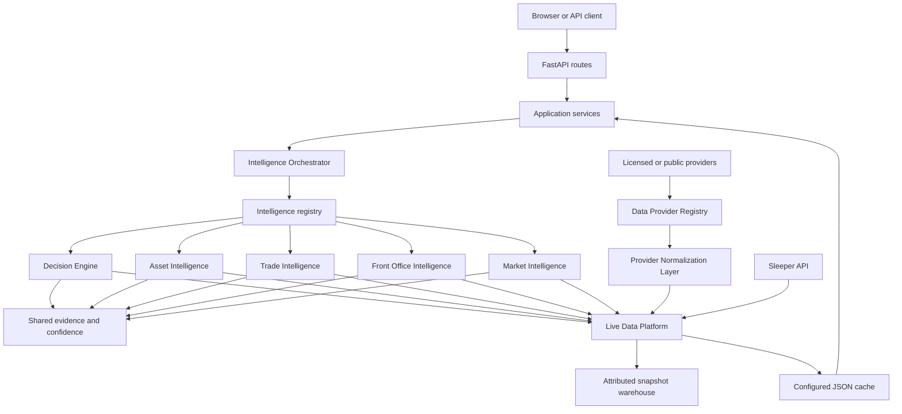

# Architecture Guide

## Valuation boundary

`src/core/valuation/universe.py` assembles current cached identity, ownership, provider, freshness, and existing valuation evidence into a read-only canonical universe. `routes/valuation.py` is the API presentation boundary. It does not synchronize providers, consume retained inspection snapshots, or modify intelligence output. See [VALUATION.md](VALUATION.md).

`src/core/asset_market/` builds the bounded, versioned exchange read model over the canonical Valuation Universe, Brain, and Historical Asset Graph. `routes/market.py` owns presentation and never triggers provider synchronization. See [ASSET_MARKET.md](ASSET_MARKET.md).

```mermaid
flowchart TD
    Browser[Browser or API client] --> FastAPI[FastAPI routes]
    FastAPI --> Services[Application services]
    Services --> Orchestrator[Intelligence Orchestrator]
    Orchestrator --> Registry[Intelligence registry]
    Registry --> Decision[Decision Engine]
    Registry --> Asset[Asset Intelligence]
    Registry --> Trade[Trade Intelligence]
    Registry --> FrontOffice[Front Office Intelligence]
    Registry --> Market[Market Intelligence]
    Decision & Asset & Trade & FrontOffice & Market --> Evidence[Shared evidence and confidence]
    Decision & Asset & Trade & FrontOffice & Market --> DataPlatform[Live Data Platform]
    External[Licensed or public providers] --> DataRegistry[Data Provider Registry]
    DataRegistry --> Normalizer[Provider Normalization Layer]
    Normalizer --> DataPlatform[Live Data Platform]
    DataPlatform --> Warehouse[Attributed snapshot warehouse]
    Sleeper[Sleeper API] --> DataPlatform
    DataPlatform --> Cache[Configured JSON cache]
    Cache --> Services
```

## Boundaries

- `dtos_app.py` owns setup, lifecycle, shared page chrome, and router registration.
- `routes/` owns HTTP translation only.
- `services/` assembles application view models and calls public platform contracts.
- `src/core/intelligence/` owns context, provider registration, orchestration, caching, evidence, confidence, conflict resolution, and unified outputs.
- `src/core/data_platform/` is the only external-provider boundary and owns provider contracts, licensing, refresh planning, provenance, storage, aggregation, quality, health, and fallback disclosure.
- `src/core/data_platform/normalization/` owns canonical player identity and mandatory provider-format reconciliation before values enter storage, consensus, APIs, or intelligence.
- Domain engines own evaluation implementations but do not call application services.
- `src/platform/` owns cross-cutting observability and validation.
- `src/ui/` owns reusable presentation contracts only. It consumes already-built
  view data and never imports or duplicates intelligence calculations.

The call dependency is Application → Orchestrator → Intelligence Engines → Data Platform → registered adapters. Inbound data flows External Providers → Provider Registry → Normalizer → Data Platform → Intelligence Orchestrator. Services and routes may not import intelligence implementation packages directly, and intelligence engines may not consume provider-specific objects.

## Data lifecycle

Presentation follows `Routes -> application services -> view models -> Design
System renderers`. Design System 1.0 standardizes hierarchy and interaction while
preserving domain ownership in the orchestrator and registered engines.

Sleeper synchronization normalizes data into one cache snapshot. A request selects a Front Office, builds an immutable intelligence context, executes or reuses provider results, aggregates evidence, resolves conflicts conservatively, and renders HTML or JSON. Refresh invalidates the affected orchestration namespace.
# DINS release-verification boundary

The web application discovers routes and serves cached inspection artifacts. The
`tools.inspection.capture` worker alone owns Chromium, navigation, screenshots, DOM
and accessibility extraction, interaction evidence, and artifact writes. This keeps
the dependency direction `read-only API -> artifact store` and prevents ordinary
requests from performing visual work or invoking intelligence engines.

The post-deployment publication boundary is `capture -> deterministic package ->
GitHub Release assets`. Production performs a brief cached, read-only GitHub release
lookup and validates immutable identity; it never owns Chromium, uploads, or generated
artifact persistence.
